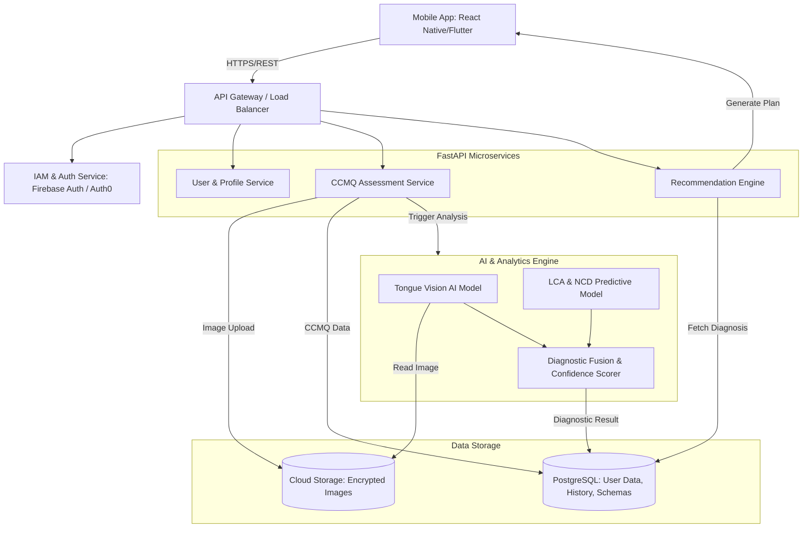

# TCM-Health: System Architecture & Functional Specifications

## 1. High-Level System Architecture

The TCM-Health application leverages a modern, scalable, and secure tech stack designed for health data processing and AI inference.

### Tech Stack
*   **Frontend (Mobile):** React Native (or Flutter) for cross-platform iOS and Android deployment.
*   **Backend (API & Logic):** Python / FastAPI for high-performance, asynchronous API endpoints, ideal for integrating with Python-based ML/AI models.
*   **Database:** PostgreSQL (Cloud SQL) for structured user data and CCMQ results, combined with Firebase/Cloud Storage for secure, temporary image storage.
*   **AI/ML Core:** PyTorch/TensorFlow for the Tongue Vision Model; Scikit-learn/XGBoost for the Predictive Analytics (NCD risk).
*   **Infrastructure:** Google Cloud Platform (GCP) or AWS, utilizing containerized microservices (Docker/Kubernetes) for scalability.

### Architecture Diagram



---

## 2. Data Logic: Diagnostic Fusion & Confidence Score

TCM diagnosis relies on multiple indicators (Four Pillars of Diagnosis). In this app, we fuse the **CCMQ (Questionnaire)** and **Tongue AI (Observation)**.

1.  **CCMQ Processing:** The 60-item questionnaire is scored to identify the primary constitution (e.g., *Qi Deficiency*, *Dampness-Heat*).
2.  **Tongue AI Processing:** The CV model segments the tongue and classifies features:
    *   *Color:* Pale, Red, Deep Red, Purple.
    *   *Coating:* Thin White, Thick Yellow, Peeled.
    *   *Shape:* Swollen (teeth marks), Thin, Cracked.
3.  **Fusion Logic (Confidence Scorer):**
    *   **High Correlation:** If CCMQ indicates *Dampness-Heat* and Tongue AI detects *Red body with Thick Yellow coating*, the Confidence Score is boosted (e.g., 90-95%).
    *   **Partial Correlation:** If CCMQ indicates *Qi Deficiency* but Tongue AI detects *Normal/Pink*, the score is moderate (e.g., 70-80%).
    *   **Conflict:** If CCMQ indicates *Yang Deficiency* (Cold) but Tongue AI detects *Deep Red with Yellow Coating* (Extreme Heat), the Confidence Score drops below a threshold (e.g., < 50%). The system flags this as an anomaly and triggers a "Consultation Recommended" alert, advising the user to see a certified TCM practitioner.

---

## 3. Recommendation Logic

The Recommendation Engine uses a deterministic Lookup Table (JSON Schema) combined with an LLM for dynamic, culturally relevant personalization.

*   **Lookup Table (Base):** Maps the 9 constitutions to strict dietary properties (Warming/Cooling), specific ingredients to eat/avoid, and exercise intensity.
*   **LLM Personalization (Dynamic):** Takes the base constraints and user preferences (e.g., "Based in Singapore", "Vegetarian") to generate specific meal plans.
    *   *Prompt Injection:* "Generate a 1-day meal plan for a user with Dampness-Heat. Use ingredients easily found in Singapore (NTUC FairPrice/Wet Markets). Avoid spicy and deep-fried foods."

---

## 4. Privacy & Ethics (GDPR/PDPA Compliance)

*   **Data Minimization & Anonymization:** Only collect necessary health data. Strip PII (Personally Identifiable Information) from CCMQ and Tongue images before sending them to the AI Core.
*   **Ephemeral Image Storage:** Tongue images are stored in a secure, encrypted bucket, processed in memory by the Vision AI, and immediately deleted (or stored only if explicit, separate consent is given for model training).
*   **Encryption:** Data at rest (AES-256 in PostgreSQL) and data in transit (TLS 1.3).
*   **Consent Management:** Explicit, granular opt-ins for data processing, AI analysis, and marketing. Users must have a "Right to be Forgotten" (one-click account and data deletion).
*   **Medical Disclaimer:** Clear UI disclaimers stating the app is for wellness and lifestyle guidance, not a replacement for professional medical diagnosis.

---

## 5. Database Schema (PostgreSQL / JSON)

```sql
-- Users Table
CREATE TABLE users (
    user_id UUID PRIMARY KEY,
    email VARCHAR(255) UNIQUE NOT NULL,
    password_hash VARCHAR(255) NOT NULL,
    date_of_birth DATE,
    gender VARCHAR(50),
    created_at TIMESTAMP DEFAULT CURRENT_TIMESTAMP
);

-- Assessments Table (History)
CREATE TABLE assessments (
    assessment_id UUID PRIMARY KEY,
    user_id UUID REFERENCES users(user_id),
    ccmq_raw_scores JSONB, -- Stores the 60-item answers
    tongue_features JSONB, -- e.g., {"color": "red", "coating": "thick_yellow"}
    primary_constitution VARCHAR(100),
    confidence_score DECIMAL(5,2),
    ncd_risk_flags JSONB, -- e.g., {"metabolic_syndrome": "high"}
    requires_consultation BOOLEAN DEFAULT FALSE,
    created_at TIMESTAMP DEFAULT CURRENT_TIMESTAMP
);

-- Daily Plans Table
CREATE TABLE daily_plans (
    plan_id UUID PRIMARY KEY,
    user_id UUID REFERENCES users(user_id),
    assessment_id UUID REFERENCES assessments(assessment_id),
    dietary_recommendations JSONB,
    exercise_recommendations JSONB,
    generated_at TIMESTAMP DEFAULT CURRENT_TIMESTAMP
);
```

---

## 6. Python Pseudocode: Recommendation Engine

```python
import json
from typing import Dict, List

# Mock Database of TCM Constitutions (Lookup Table)
TCM_KNOWLEDGE_BASE = {
    "Dampness-Heat": {
        "diet_properties": ["Cooling", "Damp-resolving"],
        "eat": ["Winter Melon", "Barley", "Green Bean", "Lotus Root"],
        "avoid": ["Mutton", "Durian", "Deep-fried foods", "Alcohol"],
        "exercise_intensity": 6,
        "exercise_types": ["Swimming", "Brisk Walking", "Cycling"]
    },
    "Qi_Deficiency": {
        "diet_properties": ["Warming", "Qi-tonifying"],
        "eat": ["Ginseng", "Yam", "Chicken", "Red Dates"],
        "avoid": ["Raw salads", "Cold drinks", "Watermelon"],
        "exercise_intensity": 3,
        "exercise_types": ["Tai Chi", "Qi Gong", "Gentle Yoga"]
    }
}

class UserConstitution:
    def __init__(self, primary_type: str, confidence_score: float, location: str = "Singapore"):
        self.primary_type = primary_type
        self.confidence_score = confidence_score
        self.location = location

class DailyPlan:
    def __init__(self, diet: Dict, exercise: Dict, warning: str = None):
        self.diet = diet
        self.exercise = exercise
        self.warning = warning

    def to_json(self):
        return json.dumps(self.__dict__, indent=4)

def generate_recommendation(user_profile: UserConstitution) -> DailyPlan:
    # 1. Check Confidence Score
    warning_msg = None
    if user_profile.confidence_score < 60.0:
        warning_msg = "Your assessment results show conflicting indicators. We highly recommend consulting a certified TCM practitioner for an accurate diagnosis."

    # 2. Fetch Base Knowledge
    base_rules = TCM_KNOWLEDGE_BASE.get(user_profile.primary_type)
    if not base_rules:
        raise ValueError("Unknown Constitution Type")

    # 3. Construct Dietary Plan (Simulating LLM/Localization logic)
    diet_plan = {
        "focus": base_rules["diet_properties"],
        "recommended_ingredients": base_rules["eat"],
        "avoid_ingredients": base_rules["avoid"],
        "localized_meal_idea": ""
    }

    # Localization Logic (Singapore Context)
    if user_profile.location == "Singapore":
        if user_profile.primary_type == "Dampness-Heat":
            diet_plan["localized_meal_idea"] = "Pork Ribs with Winter Melon Soup (available at local hawker centers) or homemade Barley Water (get ingredients from NTUC FairPrice)."
        elif user_profile.primary_type == "Qi_Deficiency":
            diet_plan["localized_meal_idea"] = "Herbal Chicken Soup or warm Yam Paste (Orh Nee) with less sugar."

    # 4. Construct Exercise Plan
    exercise_plan = {
        "intensity_scale_1_to_10": base_rules["exercise_intensity"],
        "recommended_activities": base_rules["exercise_types"]
    }

    return DailyPlan(diet=diet_plan, exercise=exercise_plan, warning=warning_msg)

# --- Example Usage ---
if __name__ == "__main__":
    # Scenario 1: High Confidence Dampness-Heat
    user_1 = UserConstitution(primary_type="Dampness-Heat", confidence_score=92.5)
    plan_1 = generate_recommendation(user_1)
    print("User 1 Plan:\n", plan_1.to_json())

    # Scenario 2: Low Confidence Qi Deficiency (Conflict detected)
    user_2 = UserConstitution(primary_type="Qi_Deficiency", confidence_score=45.0)
    plan_2 = generate_recommendation(user_2)
    print("\nUser 2 Plan:\n", plan_2.to_json())
```
